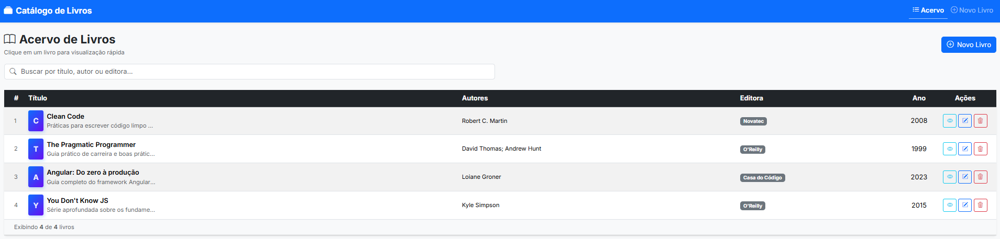

# 📚 Catálogo de Livros — Angular 17+

Sistema de gestão de acervo desenvolvido com Angular, Bootstrap 5 e TypeScript estrito.
Projeto Acadêmico com foco em arquitetura limpa, boas práticas SOLID e tipagem forte.


---

## 🏗️ Arquitetura

```
src/app/
├── core/                        # Lógica de negócio central (sem UI)
│   ├── models/
│   │   ├── editora.model.ts     # Classe Editora
│   │   └── livro.model.ts       # Classe Livro
│   └── services/
│       ├── controle-editora.service.ts   # CRUD de editoras em memória
│       └── controle-livros.service.ts    # CRUD de livros em memória
│
├── features/                    # Módulos funcionais (UI por domínio)
│   └── livros/
│       ├── livro-lista/         # Listagem + exclusão
│       └── livro-dados/         # Formulário de cadastro
│
├── shared/                      # (reservado) Pipes, Diretivas, Guards reutilizáveis
│
├── app.module.ts                # Módulo raiz — declara componentes e imports
├── app-routing.module.ts        # Configuração de rotas
└── app.component.*              # Shell: Navbar + <router-outlet> + Footer
```

---

## 🚀 Início Rápido

### Pré-requisitos
- Node.js 18+ → https://nodejs.org
- Angular CLI 17+ → `npm install -g @angular/cli`

### Instalação e execução

```bash
# Clonar / entrar na pasta do projeto
cd catalogo-livros

# Instalar dependências
npm install

# Iniciar servidor de desenvolvimento (abre o browser automaticamente)
ng serve --open
```

A aplicação estará disponível em: **http://localhost:4200**

---

## ✨ Funcionalidades

| Rota | Componente | Descrição |
|---|---|---|
| `/livros` | `LivroListaComponent` | Lista todos os livros com opção de exclusão |
| `/livros/novo` | `LivroDadosComponent` | Formulário para cadastrar novo livro |
| `/**` (wildcard) | — | Redireciona para `/livros` |

---

## 🧠 Conceitos

### Injeção de Dependência
O Angular cria **uma única instância** de cada serviço (`@Injectable providedIn: 'root'`) e a entrega automaticamente para quem declarar no constructor. Isso evita código acoplado e facilita testes.

### Lifecycle Hooks
- `constructor()` → apenas recebe dependências
- `ngOnInit()` → carrega dados e inicializa a lógica

### Two-Way Binding `[(ngModel)]`
Sincroniza automaticamente o valor de um campo HTML com a propriedade do componente nos dois sentidos.

### Diretivas Estruturais
- `*ngIf` → adiciona/remove elementos do DOM
- `*ngFor` → itera sobre arrays, criando elementos dinamicamente

### trackBy
Otimização do `*ngFor`: identifica itens pelo `codLivro` para evitar re-renderização desnecessária da tabela inteira.

---

## 🔧 Comandos Úteis

```bash
# Gerar novo componente
ng generate component features/nome-feature/nome-componente

# Gerar novo serviço
ng generate service core/services/nome-servico

# Build de produção
ng build

# Verificar erros de tipagem
npx tsc --noEmit
```

---

## ⚖️ Trade-offs: Didático vs. Produção

| Aspecto | Este Projeto | Produção Corporativa |
|---|---|---|
| Persistência | Array em memória | API REST + interceptors HTTP |
| Formulários | Template-driven | Reactive Forms + Validators customizados |
| Módulos | NgModules | Standalone Components (padrão Angular 17+) |
| Carregamento | Eager (tudo de uma vez) | Lazy loading por feature |
| Estado global | Local nos componentes | NgRx Store ou Signals |
| Testes | — | Karma/Jest + Cypress e2e |
| Autores | String separada por vírgula | Entidade própria com relacionamento N:N |
| Erros | `console.warn` | Serviço de logging + tratamento HTTP |

---

